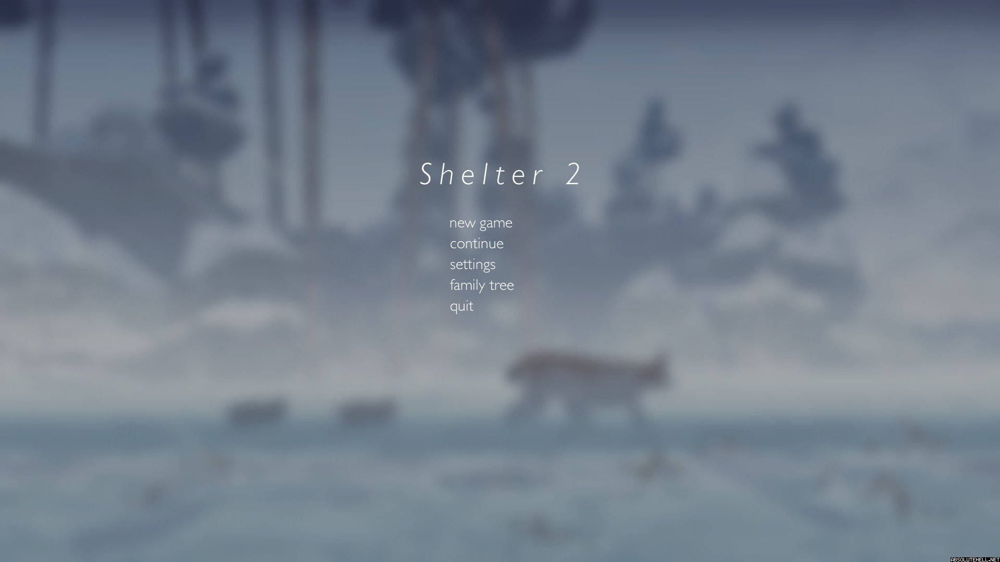
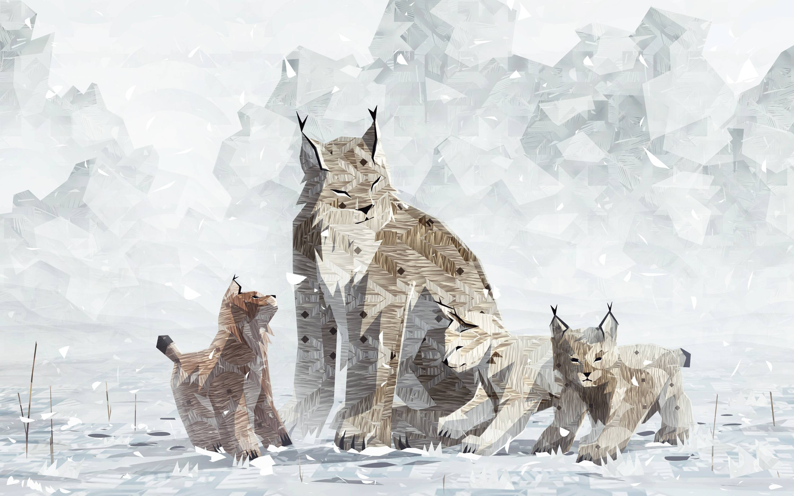

I must be the worst candidate for being a good mother. One, my beard is starting to weave into my chest hair; two, if Shelter 2 has taught me anything i will hate my children until they leave me. Don't get me wrong, I loved my little lynx children but actually giving a shit if they lived or died while trying to provide for them was extremely frustrating. To give you an example I'm learning the game mechanics and the best way to hunt down rabbits so I can feed my cute lynx babies. One of my children then starts bitching and moaning and lays down. Natural parent instincts kick in and go, oh he is tired he needs food. I run around pick up a rabbit and give it to him. This white coat little fucker just looks at it like a deer at oncoming traffic. He knows he is going to die but is so pitifully stupid that he doesn't eat it. In a fit of rage I pick the fucker up in my mouth and put him back down. Without eating anything this piece of shit starts walking around like nothing happened. Cool I think to myself, I'm the best parent ever. Fast Forward and the same piece of shit kid lays down, activate parent mode and pick him up and put him down. This does nothing, activate regular parent mode and find the fucker some food. Can't find food, oh shit kid is gonna die, keep running around, finally kill a rabbit to give to the kid. I quickly run back to my starving child, only for him to look at the food, stand up and then die; fucking idiot. Yet somehow at the end of the game when my kids are all grown up I still felt sad that they left.

Shelter 2 is the second game in the shelter franchise. The first game in the series was one of the best badger mother simulators out there. It tells the gripping tale of a mother who must take care of her children. It somehow make you care about your digital badger children and helps describe the sacrifice and love that mothers provide for their children. Shelter 2 is the the same narrative but now with different animals. Shelter 2 throws you into the roll of a mother lynx that must take care of her children. You must hunt and try to provide for 4 babies that are oh so god damn needy. Shelter 2 sets itself apart from the first one by having your surviving children carry on and create a family tree. This gives Shelter 2 some replay-ability so that you can create a lineage of hard providing mothers and dead children. What is even cooler than the family tree of dead children and mothers is the fact that there is fur color and patterns that can be passed down to your offspring.

If you couldn't tell I do like the concept of the game. It is a beautiful game with an interesting art style and the music also helps put you in the motherly mood. The art of this game is beyond beauty, it has this crumpled up paper smoothed out again feel to it. It is one of the more redeeming qualities about the series. The art helps also build a sense of wonder an mystery as you will want to explore more and more of the world to see more and more of the world because it is gorgeous. There are times while playing this game that the music really complements the mood and theme of what is currently going on. When you are stalking prey the music gets quite, when you are chasing prey the music becomes more intense and thrilling, when something sad happens the music is there to reassure that you will have to explain to onlookers why you are crying over a digital lynx.

Yet even though I like the game and everything that it sets out to do I still have some major issues with the game. One of the first problems I have with it is the pacing of the game. It starts with a quick tutorial and then you are shown a nice image of you and your children before you have to go out in the world and provide for them. You plunge into the world and....then....you really don't have any clear objective. Which is fine, it leaves the game open ended, it allows you to do anything you want while also providing for your children. You lack anything to do other than avoid the predators, kill prey, and collect hidden objects. This would be fine but then comes the initial problem that I brought up about the pacing of the game. This game is slow, which is really bad, considering that to get to the end only takes an hour and a half. The camera is a bit of a let down as well. The camera angles are odd and too close to my own ass that it makes seeing the environment around you harder than it should be. This is an extreme letdown because of how beautiful this game looks. The next problem I have with the game is something I'm a bit hesitant to bring up. I have no idea if it was because I was using Windows 10, my computer was acting up for whatever reason, or something else but the game had a hard time staying above 30 fps, overall my computer was averaging 45 fps. This is a bit discerning considering I have a GTX 970 in the computer I was playing this on. This made the game frustrating because most of the game involves hunting prey at high speed causing you to miss your prey making the burden of providing for your eBabies more frustrating. I tried to see if anybody else was having similar problems but couldn't find anything. So buyer beware it may inexplicably under perform.

Overall Shelter 2 is a good game if you have an hour or so to kill and would like to see a progression system based on your surviving offspring it is the perfect game for you. If you are looking for a game with a lot substance that doesn't feel slow and action-y then you might want to skip this title. It does what it sets out to do well, to tell through the video game narrative of the self sacrifice and hard work mothers provide for their children. If the game didn't do that then why the hell would I spend almost nine lines of text describing my virtual lynx offspring.

Buy Shelter 2 on [Steam](http://store.steampowered.com/app/275100/) or [GoG](https://www.gog.com/game/shelter_2).
