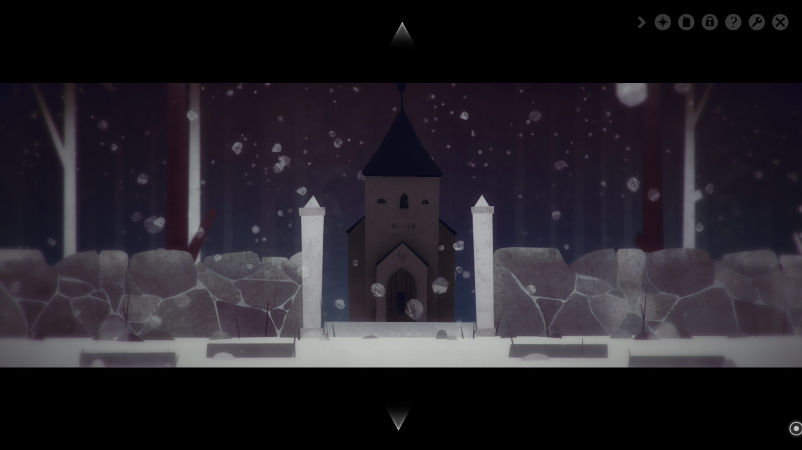

Year Walk is a horror point and click game loosely based on Årsgång, the Swedish folk tradition that only the Swedish people could come up with. It involves people locking themselves up in a room without eating, drinking, or talking. At midnight the person would go to a church where they would blow into a keyhole and loose there Christianity. From there the "year walker" would then be visited by supernatural beings who would then test them. If the year walker was successful they would be able to see into the future. If that concept sounds weird or even confusing in the slightest then Year Walk is the game for you.

Year Walk is probably one of the better horror games out there that you can pick up right now. Not only is the concept interesting and based on something people actually did, it is also extremely cheap (6 USD at the time of this review) and gets even cheaper during sales. The art style of this game is beautiful combining a mix of hand drawn and paper cut out styles that gives it a unique and interesting style. The creatures and the environments are extremely well done and feed into the uncomfortable atmosphere of the game. Did I mention that this game is one of the more disturbing games I have ever played? Well it is and when looking up information for this review I can vividly remember what happens and found myself reeling back in anticipation. A mark of a truly great horror game is one where you know what is going to happen but find yourself scared of the event to come. The puzzles in this game are well thought out and feeds into the lore of the game.

As much praise as I have given this game it is not without its flaws. The major flaw this game has is one that plagues all point and click games and that is not knowing what to do. Standard point and click logic wont help you in this game either because of the narrative feeds into the absurdity. Some of the puzzles are hard and require digging into those books and notes that will give you a clue of what to do. In addition if you are truly stuck there is a hint system built into the game allowing you to gain more insight into what to do. This is a good fix to a hard problem to tackle but it does not make the puzzles more easier. The last complaint I would have about this game is that it is relatively short, around 1 to 3 hours of gameplay based on how quickly you can solve the puzzles.

 This review is shorter than most of my other reviews because this is a game that you should experience and I do not want to spoil it. Overall Year Walk is a fantastic psychological horror game with amazing lore behind it. It truly only suffers from one of the most common problems within the point and click genre. The game is going to stick with you, probably causing some trauma along the way. For the price point at which it is being offered there isn't a reason why you shouldn't pick this game up. Year walk is fun, genuinely disturbing, and short. The fact that you can experience the traditions of another country (or your own country that you may have never known about) is just icing on the cake.

Buy Year Walk on [Steam](http://store.steampowered.com/app/269050/).
